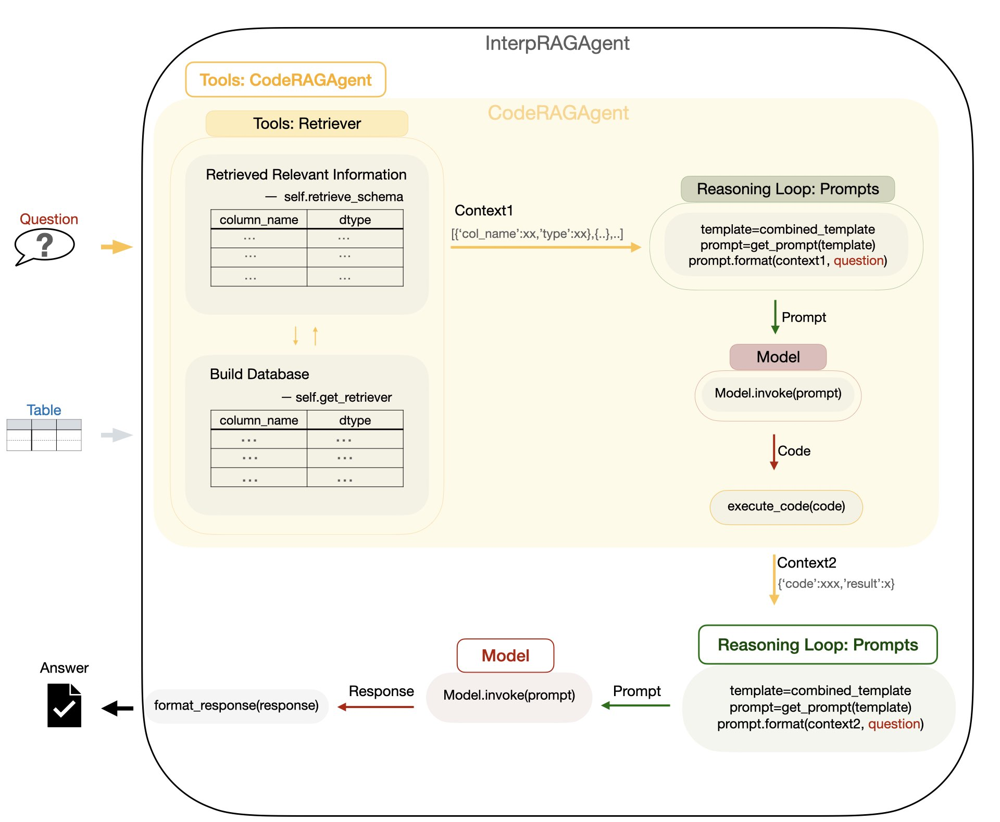

# Project Introduction:
This project focuses on building a tabular data Q&A system by using double rag with language models.

# Set up environment
pip install -r requirements.txt

# Data
- The data used in the `test_case.ipynb` are the `students_performance.csv`  and `product.csv` files. The `students_performance.csv` is downloaded from the [kaggle](https://www.kaggle.com/datasets/spscientist/students-performance-in-exams) website, and the `product.csv` is randomly generated using pandas code.
- The data used in the `test_evaluate.ipynb` is the `sample_score.csv` file, which is created by randomly selecting 20 rows of data from the `students_performance.csv` file.
  
You can see all the data in the `data` folder.

# Modules Introduction:
## `main.py`
This file serves as the entry point for the application, orchestrating the main functionality
of the retrieval-augmented generation system. It initializes necessary components(uses the best parameter combination chosen by the test_evaluate.ipynb file), processes input data,and handles user queries to generate responses.

Functionality:

- The `main` function reads a DataFrame from a CSV file, initializes the retriever, prompt and model(instances of the classes/functions defined in the retriever.py, prompt.py, and model.py files respectively),and sets up the agents for code generation and interpretation.It processes a predefined query to retrieve relevant information and generate a response.
- The application can be run directly, executing the main function.

Usage:

- For running directly:
1. Ensure the required CSV file ('data/product.csv') is available in the working directory.
2. Run the script to execute the main function:
   ```bash
   python main.py
   ```
   The application will process the query and output the results to the console.

- For calling the main function with your desired DataFrame and query:
   ```python
   from main import main
   main(df=pd.read_csv('your_file.csv'), query="Your question here")
   ```

## `agent.py`
This file defines the `CodeRAGAgent` and `InterpRAGAgent` classes, which are responsible for processing queries and generating responses using a retrieval-augmented generation approach.

Functionality:
- The `CodeRAGAgent` class retrieves relevant context(schema information of the dataframe) based on a query, formats the combined_prompt, invokes the model use combined_prompt as the prompt,and executes the generated code to obtain results.
- The `InterpRAGAgent` class processes context(the results of the `CodeRAGAgent`) and queries to generate textual responses using a model,and formats the output for user-friendly presentation.

Usage:
- For the `CodeRAGAgent`:
1. Create an instance of the `CodeRAGAgent` class with the necessary parameters(the retriever, prompt, and model are instances of the classes/functions defined in the retriever.py, prompt.py, and model.py files, respectively.):
   ```python
   from agent import CodeRAGAgent
   from retriever import Retriever
   from prompt import get_prompt, combined_template
   from model import Model

   retriever = Retriever(mode=your_mode, embed_model_name=your_embed_model_name, db=your_db)
   prompt = get_prompt(combined_template)
   model = Model(model_name="your_model_name", additional_param=dict(key=value))
   agent = CodeRAGAgent(retriever, prompt, model, df)
   ```
2. Call the invoke method with a query to get the generated code and execution result:
   ```python
   result = agent.invoke(query)
   ```

- For the `InterpRAGAgent`:
1. Create an instance similarly(the prompt and model are instances of the classes/functions defined in the prompt.py and model.py files, respectively.):
   ```python
   from agent import InterpRAGAgent
   from prompt import get_prompt, interp_template
   from model import Model

   prompt = get_prompt(interp_template)
   model = Model(model_name="your_model_name", additional_param=dict(key=value))
   interp_agent = InterpRAGAgent(prompt, model)
   ```
2. Call the invoke method with context(the results of the CodeRAGAgent) and query to get the formatted response:
   ```python
   response = interp_agent.invoke(result, query)
   ```

## `model.py`
This file defines a `Model` class for handling different types of language models, including local and remote models.

Functionality:
- The `Model` class supports calling language models through the OllamaLLM and ChatGroq libraries.
- The `invoke` method automatically selects either the local model or the remote model based on the format of the model name (whether it contains a '-').

Usage:
1. Import this file and create an instance of the Model class:
   ```python
   from model import Model

   model_instance = Model(model_name="your_model_name", additional_param=dict(key=value))
   ```
2. Call the invoke method and pass in a prompt:
   ```python
   response = model_instance.invoke("Your prompt content")
   ```
   Depending on the model, the invoke method will return the corresponding result:
   - If the model name contains '-', the remote model (ChatGroq) will be used.
   - Otherwise, the local model (OllamaLLM) will be used.

Note: When using the remote model, a valid GROQ_API_KEY is required.

## `prompts.py`
This file defines a `get_prompt` function and two templates for generating dynamic prompts for the CodeRAGAgent and InterpRAGAgent.

Functionality:
- The `get_prompt` function creates a prompt template object that generates dynamic prompt content based on the given template and input variables.
- The `combined_template` is a template for the CodeRAGAgent, which uses Chain of Thought and few_shot prompting engineering technologies to assist in generating pandas code based on the context and query.
- The `interp_template` is a template for the InterpRAGAgent, which uses few_shot prompting engineering technology to assist in generating textual responses based on the context and query.
  
Usage:
1. Import this file and create an instance of the Prompt Template object:
   ```python
   from prompts import get_prompt, combined_template, interp_template

   prompt_object = get_prompt(combined_template)
   ```
   or
   ```python
   prompt_object = get_prompt(interp_template)
   ```
2. Call the format method with the context and query:
   ```python
   formatted_prompt = prompt_object.format(context, query)
   ```

## `retriever.py`
This file defines a `Retriever` class for handling different retrieval modes, including 'bm25', 'embed', and 'hybrid'.
It utilizes various retrievers from the Langchain library to process documents and return relevant results.

Functionality:
- The `Retriever` class initializes with a specified mode, embedding model name(from langchain_huggingface), and vector database.
- It provides methods to build a schema corpus from a DataFrame and retrieve documents based on the selected mode.

Usage:
1. Import this file and create an instance of the Retriever class:
   ```python
   from retriever import Retriever
   from langchain_chroma import Chroma 
   from langchain_community.vectorstores import FAISS

   retriever_instance = Retriever(mode="your_mode", embed_model_name="your_model_name", db=your_db)
   ```
2. Call the retrieve_schema method with a query and DataFrame:
   ```python
   results = retriever_instance.retrieve_schema("your_query", your_dataframe)
   ```

## `execute.py`
This file defines some python functions that are used in the two Agents for executing the generated pandas code and formatting the responses.

Functionality:
- The `extract_code` function is used to extract python code from the answer of the first_layer agent.
- The `execute_code` function is used to execute the code and get the results.
- The `parse_response` function is used to parse the response of the second_layer agent to a dict. 
- The `format_response` function is used to print a clearly structured and user-friendly format for the user to read.

Usage:
1. Import this file and call the `execute_code` function with the generated code:
   ```python
   from execute import execute_code

   result = execute_code(generated_code)
   ```
2. Call the `format_response` function with the response:
   ```python
   from execute import format_response

   formatted_response = format_response(response)
   ```


## `evaluator.py`
This file defines classes and functions for evaluating retrieval and generation models performance.
It includes metrics such as Recall@k and Mean Reciprocal Rank (MRR) for retrieval evaluation,
Exact Match and F1 Score for code generation evaluation,
and a function for computing the F1 score using the BERTScore method for textual generation evaluation.

Functionality:
- The `RetrievalEvaluator` class computes Recall@k and MRR metrics to assess the effectiveness of document retrieval systems.
- The `GenerCodeEvaluator` class calculates Exact Match and F1 Score metrics to evaluate the quality of generated code against reference code.
- The `bert_score_f1` function computes the F1 score using the BERTScore method for comparing generated and reference texts.

Usage:
- For retrieval evaluation:
1. Create an instance of the RetrievalEvaluator class with retrieved and relevant documents:
   ```python
   from evaluator import RetrievalEvaluator

   evaluator = RetrievalEvaluator(retrieved_docs, relevant_docs)
   ```
2. Call the evaluate method to get the evaluation metrics:
   ```python
   metrics = evaluator.evaluate()
   ```

- For code generation evaluation:
1. Create an instance of the GenerCodeEvaluator class with generated code and reference code:
   ```python
   from evaluator import GenerCodeEvaluator

   code_evaluator = GenerCodeEvaluator(generated_code, reference_code)
   ```
2. Call the evaluate method to get the Exact Match and F1 Score:
   ```python
   code_metrics = code_evaluator.evaluate()
   ```

- For textual generation evaluation:
Use the bert_score_f1 function to compute the F1 score between generated text and reference text:
   ```python
   from evaluator import bert_score_f1

   f1_score = bert_score_f1(generated_text, reference_text)
   ```


## `test_evaluate.ipynb`
In this notebook, I use these metrics defined in the `evaluator.py` file to test the performance of the different parameters of the Retriever class, code generation Model class and textual response generation Model class separately. And then choose the best combination for each class to use in the `main.py` file.

## `test_case.ipynb`

This notebook displays some user Q&A examples using the `main` function in the `main.py` file to show how the system works.


# System Architecture Diagram


# Diagrams
- The workflow diagrams of the modules are in the `diagrams` folder.